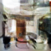

# WGAN TensorFlow Implementation

TensorFlow implementation of [Wasserstein GAN, arxiv:1701:07875](https://arxiv.org/abs/1701.07875)


## Results

Generated bedroom images from the LSUN trained model (only trained 0.6 epoch).

    


## Installation

```
$ git clone https://github.com/kuc2477/tensorflow-wgan && cd tensorflow-wgan
$ pip install -r requirements.txt
```


## CLI

Implementation CLI is provided by `main.py`

#### Usage
```
$ ./main.py --help
$ usage: main.py [-h] [--dataset DATASET] [--z_size Z_SIZE]
               [--image_size IMAGE_SIZE] [--channel_size CHANNEL_SIZE]
               [--g_filter_number G_FILTER_NUMBER]
               [--c_filter_number C_FILTER_NUMBER]
               [--g_filter_size G_FILTER_SIZE] [--c_filter_size C_FILTER_SIZE]
               [--clip_size CLIP_SIZE] [--epochs EPOCHS]
               [--batch_size BATCH_SIZE] [--sample_size SAMPLE_SIZE]
               [--learning_rate LEARNING_RATE] [--beta1 BETA1]
               [--loss_log_interval LOSS_LOG_INTERVAL]
               [--image_log_interval IMAGE_LOG_INTERVAL]
               [--critic_update_ratio CRITIC_UPDATE_RATIO] [--test [TEST]]
               [--notest] [--resume [RESUME]] [--noresume] [--log_dir LOG_DIR]
               [--sample_dir SAMPLE_DIR] [--checkpoint_dir CHECKPOINT_DIR]
               [--resize [RESIZE]] [--noresize] [--crop [CROP]] [--nocrop]

optional arguments:
  -h, --help            show this help message and exit
  --dataset DATASET     dataset to use dict_keys(['lsun', 'mnist', 'images'])
  --z_size Z_SIZE       size of latent code z [100]
  --image_size IMAGE_SIZE
                        size of image [32]
  --channel_size CHANNEL_SIZE
                        size of channel [1]
  --g_filter_number G_FILTER_NUMBER
                        number of generator's filters at the last transposed
                        conv layer
  --c_filter_number C_FILTER_NUMBER
                        number of critic's filters at the first conv layer
  --g_filter_size G_FILTER_SIZE
                        generator's filter size
  --c_filter_size C_FILTER_SIZE
                        discriminator's filter size
  --clip_size CLIP_SIZE
                        parameter clipping size to be applied to the critic
  --epochs EPOCHS       number of the epochs to train
  --batch_size BATCH_SIZE
                        training batch size
  --sample_size SAMPLE_SIZE
                        generator sample size
  --learning_rate LEARNING_RATE
                        learning rate for Adam [0.00002]
  --beta1 BETA1         momentum term of Adam [0.5]
  --loss_log_interval LOSS_LOG_INTERVAL
                        number of batches per logging losses
  --image_log_interval IMAGE_LOG_INTERVAL
                        number of batches per logging sample images
  --critic_update_ratio CRITIC_UPDATE_RATIO
                        number of updates for critic parameters per
                        generator's updates
  --test [TEST]         flag defining whether it is in test mode
  --notest
  --resume [RESUME]     whether to resume training or not
  --noresume
  --log_dir LOG_DIR     directory of summary logs
  --sample_dir SAMPLE_DIR
                        directory of generated figures
  --checkpoint_dir CHECKPOINT_DIR
                        directory of model checkpoints
  --resize [RESIZE]     whether to resize images on the fly or not
  --noresize
  --crop [CROP]         whether to use crop for image resizing or not
  --nocrop
```

#### Dataset
```
$ ./download.py mnist lsun
$ ./data.py export_lsun
```

#### Train
```
$ tensorboard --logdir=logs &
$ ./main.py --dataset=mnist [--resume]
```

#### Test
```
$ ./main.py --test
$ # checkout "./samples" directory.
```


## Reference
- [Wasserstein GAN, arxiv:1701:07875](https://arxiv.org/abs/1701.07875)


## Author
Ha Junsoo / [@kuc2477](https://github.com/kuc2477) / MIT License
